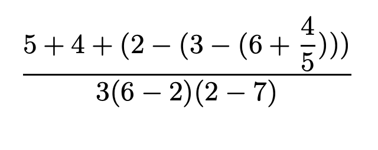

# Упражнение

## Упражнение 1.1.
Ниже приведена последовательность выражений. Какой результат напечатает интерпретатор в ответ на каждое из них? Предполагается, что выражения вводятся в том же порядке, в каком они написаны.

```js
> 10 
10 

> (+ 5 3 4) 
12 

> (- 9 1) 
8 

> (/ 6 2) 
3 

> (+ (* 2 4) (- 4 6)) 
6 

> (define a 3) 

> (define b (+ a 1)) 

> (+ a b (* a b)) 
19 

> (= a b) 
#f 

> (if (and (> b a) (< b (* a b))) 
      b 
      a) 
4 

> (cond ((= a 4) 6) 
        ((= b 4) (+ 6 7 a)) 
        (else 25)) 
16 

> (+ 2 (if (> b a) b a)) 
6 

> (* (cond ((> a b) a) 
           ((< a b) b) 
           (else -1)) 
     (+ a 1)) 
16
```
---
## Упражнение 1.2.
Переведите следующее выражение в префиксную форму:




```js 
(/ (+ 5 4 (- 2 (- 3 (+ 6 (/ 4 5)))))
   (* 3 (- 6 2) (- 2 7)))
```
---

## Упражнение 1.3.

Определите процедуру, которая принимает в качестве аргументов три числа и возвращает сумму
квадратов двух больших из них. 

---

## Упражнение 1.4.
Заметим, что наша модель вычислений разрешает существование комбинаций, операторы которых — составные выражения. С помощью этого наблюдения опишите, как работает следующая
процедура:
```js
(define (a-plus-abs-b a b)
  ((if (> b 0) + -) a b))
```
---

## Упражнение 1.5.
Бен Битобор придумал тест для проверки интерпретатора на то, с каким порядком вычислений он
работает, аппликативным или нормальным. Бен определяет такие две процедуры:

```js
(define (p) (p))

(define (test x y)
  (if (= x 0)
      0
      y))
```

Затем он вычисляет выражение
```js
(test 0 (p))
```
Какое поведение увидит Бен, если интерпретатор использует аппликативный порядок вычислений?
Какое поведение он увидит, если интерпретатор использует нормальный порядок? Объясните Ваш
ответ. (Предполагается, что правило вычисления особой формы if одинаково независимо от того,
какой порядок вычислений используется. Сначала вычисляется выражение-п

---

## Упражнение 1.6.
Лиза П. Хакер не понимает, почему if должна быть особой формой. «Почему нельзя просто
определить ее как обычную процедуру с помощью cond?» — спрашивает она. Лизина подруга Ева
Лу Атор утверждает, что, разумеется, можно, и определяет новую версию if:
```js
(define (new-if predicate then-clause else-clause)
  (cond (predicate then-clause)
        (else else-clause)))
```
Ева показывает Лизе новую программу:

---

